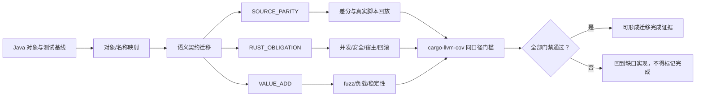
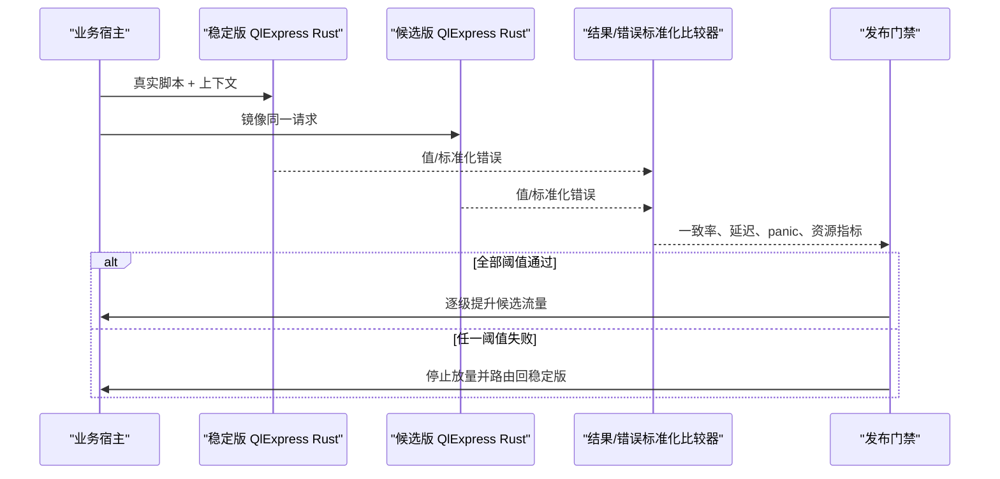

# QlExpress Rust 技术要求

本文是 Java QLExpress 4.2.0-beta 向 QlExpress Rust 迁移的强制验收契约。
它约束的是外部可观察语义和生产质量，不以“存在同名文件”“能够编译”或
“Rust 测试数量更多”替代完成度证明。

## 1. 固定审计基线

| 项目 | 固定值 |
|---|---|
| Java 仓库 | `/Users/wandl/workspaces/workspace-github/QLExpress` |
| Java commit | `9065b9ac5d985dcd02e627239aa9cdb78fb2f7f3` |
| Rust 仓库 | `/Users/wandl/workspaces/workspace-github-easy-4-rust/qlexpress-rust` |
| Rust 审计起点 | `d5b6aab541f2629afe3c975774cbf0f97b6af18c` |
| Java 测试工具链 | JDK 17 + Maven + JaCoCo |
| Rust 测试工具链 | stable Rust + cargo-llvm-cov 0.8.7 |
| Rust MSRV | 1.85 |

任何完成度报告必须同时给出两个 commit、工具链、执行命令和统计口径。
Java JaCoCo 仅统计生产类；Rust 对标口径仅统计 `crates/qlexpress/src/**`，
workspace 总覆盖率须另列，禁止把 derive、verification 或测试代码混入核心口径。

## 2. 迁移完成定义

迁移完成必须同时满足：

1. [对象级对照表](对象级对照表.md) 中 237 个 Java 生产对象均有真实职责承接；
2. [对象名称一致性检查](对象名称一致性检查.md) 通过文件、类型和导出边界检查；
3. [语义迁移对照表](语义迁移对照表.md) 的语法、运行时、异常、缓存、安全、
   宿主扩展和运维契约均有可执行证据；
4. [迁移测试对照表](迁移测试对照表.md) 的 `SOURCE_PARITY`、
   `RUST_OBLIGATION`、`VALUE_ADD` 三台账无 `MISSING`、`PARTIAL`、
   `PENDING` 或 `BLOCKED`；
5. Java 原测试、Java/Rust 差分、真实脚本回放、Rust 全测试和生产门禁均通过；
6. Rust 核心生产代码覆盖率满足独立的回归门槛，且新增/变更高风险路径
   有分支、错误和副作用断言。该统计只证明 Rust 测试执行到了相应代码，
   **不**证明其与 Java 功能或语言语义一致，不能与第 1–5 项互相替代。



## 3. Java 语义不可简化

### 3.1 解析与执行

- 保留词法规则、运算符优先级/结合性、严格换行、字符串插值、selector、
  lambda、宏、函数、循环、switch、try/catch/finally、throw 和 return 语义。
- 保留 Java 数值提升矩阵、int/long 补码回绕、BigInteger 任意精度、
  BigDecimal 十进制行为、浮点 IEEE 行为及整除/余数/模的差异。
- 保留短路求值、懒参数、作用域遮蔽、污染宿主上下文选项和超时语义。
- 指令栈的参数顺序、返回类型、异常表跳转和 trace 节点结构必须可验证。

### 3.2 成员、构造器与对象字面量

- JVM 反射由 `NativeRegistry`、`NativeType`、`NativeObject` 和 derive 显式替代；
  不得通过开放任意 Rust 类型或动态符号绕过安全策略。
- 字段读取必须支持实例/静态字段、alias 和左值；可写字段需执行类型转换并写回。
- `readonly` 字段只允许读取；脚本赋值或分类对象字面量填充必须拒绝，而不是静默写入。
- `{'@class': 'Type', field: value}` 必须先调用注册构造器，再逐字段写入；
  缺失字段沿用 Java 忽略语义，只读或类型不兼容字段返回赋值错误。
- 方法和构造器解析必须保持精确匹配、数值提升/降级优先级、null、varargs
  和无合适候选时的错误码。

### 3.3 异常与诊断

- Java checked/unchecked exception 在 Rust 中统一通过 `thiserror` + `Result`
  承载，但错误码、reason、源位置和可捕获对象不可丢失。
- 语法错误、运行时错误、超时、非法算术、空字段、索引越界、类/方法/
  构造器不存在必须有独立可断言契约。
- 禁止以 panic 替代正常脚本错误；只有 Java 本身对应
  `IllegalArgumentException`/数组容量越界等构造期不变量时才允许受控 panic。

## 4. Rust 原生适配要求

| Java 机制 | Rust 承接 | 强制验证 |
|---|---|---|
| Jackson parse cache | serde + serde_json | 全指令家族往返、跨 runner 执行一致 |
| 反射/ClassLoader/PF4J | NativeRegistry + ClassSupplier | 显式注册、匹配优先级、安全策略 |
| synchronized/共享缓存 | Rust 所有权 + 同步容器 | 并发无竞态、每 worker runner 隔离 |
| checked exception | QLException + Result | 错误码、reason、位置、catch |
| Lombok/注解 | derive 过程宏 | trybuild/运行时 getter、setter、alias、readonly |
| Spring 宿主演示 | verification 业务宿主 | 上下文、函数注册、错误、缓存、并发 |

生产代码禁止 `todo!()`、`unimplemented!()`、空函数体、占位 `compat.rs`
和 wildcard import；`mod.rs` 只允许模块声明及重导出。

## 5. 测试要求

### 5.1 三台账

- `SOURCE_PARITY`：每个 Java 测试方法至少一行，记录输入、结果/错误、
  副作用、隔离/清理以及 `MIRRORED`、`ADAPTED`、`SPLIT` 等状态。
- `RUST_OBLIGATION`：补充所有权、并发、serde、feature、过程宏、注册表、
  安全边界和宿主适配风险。
- `VALUE_ADD`：记录自动差分、真实脚本回放、属性测试、fuzz、负载和灰度演练。

不得按测试名称自动映射，不得因为 Rust 测试数量大于 Java 就认定覆盖，
不得删除仅被静态启发式标记的测试。

### 5.2 覆盖率门槛

固定 Java 基线：

| 指标 | 覆盖/总数 | 覆盖率 |
|---|---:|---:|
| Java instruction | 34,237 / 40,903 | 83.70% |
| Java branch | 3,046 / 3,987 | 76.40% |
| Java line | 7,764 / 9,151 | **84.84%** |
| Java method | 2,019 / 2,381 | 84.80% |
| Java class | 350 / 356 | 98.31% |

当前 Rust 审计结果：

| 口径 | 覆盖/总数 | 覆盖率 | 结论 |
|---|---:|---:|---|
| `crates/qlexpress/src/**` 核心行 | 26,683 / 30,233 | **88.26%** | Rust 回归覆盖观察值；不与 Java 语义等价 |
| `crates/qlexpress/src/**` 核心分支 | 2,817 / 3,734 | **75.44%** | nightly 显式分支口径 |
| workspace 行 | 27,197 / 32,650 | **83.30%** | 单独披露，不作为核心对标；差分执行器扩展增加未由 cargo test 调用的命令路径 |
| workspace 分支 | 2,859 / 3,808 | **75.08%** | nightly 显式分支口径 |
| workspace function | 3,155 / 3,733 | **84.52%** | 持续提升 |
| workspace region | 41,000 / 49,991 | **82.01%** | 持续提升 |

覆盖率只是一道 Rust 回归门槛，不能用于比较两种语言的实现质量，更不能作为
Java/Rust 语义一致性的证据。语义一致性必须由相同输入、上下文、选项和宿主
能力下的值、类型、异常、位置、状态变化、trace 与副作用差分证明。新增测试
还必须能杀死合理 mutant，例如参数顺序交换、错误码替换、短路分支误执行、
字段未写回、MIN/-1 误报除零、缓存导入不执行等。

## 6. 分层验收命令

```bash
# 静态对象/测试清单
python3 /Users/wandl/.agents/skills/rust-java-migration/scripts/audit_migration_layout.py \
  --rust-root .
python3 /Users/wandl/.agents/skills/rust-java-migration-testing/scripts/audit_migration_tests.py \
  --java-root /Users/wandl/workspaces/workspace-github/QLExpress \
  --rust-root . --format json

# Rust 质量门禁
cargo fmt --all -- --check
cargo clippy --workspace --all-targets --all-features -- -D warnings
cargo test --workspace --all-features
RUSTDOCFLAGS="-D warnings" cargo doc --workspace --all-features --no-deps

# 差分、回放与生产验收
python3 verification/run_differential.py \
  --java-repo /Users/wandl/workspaces/workspace-github/QLExpress
cargo run -p qlexpress-verification -- replay \
  /Users/wandl/workspaces/workspace-github/QLExpress
cargo run -p qlexpress-verification -- concurrency
cargo run -p qlexpress-verification -- security-fuzz
cargo run -p qlexpress-verification -- business-host
cargo run -p qlexpress-verification -- canary
cargo run -p qlexpress-verification -- load
cargo +nightly fuzz run parser_sandbox fuzz/corpus/parser_sandbox -- -max_total_time=30

# 覆盖率
cargo llvm-cov --workspace --all-features --json \
  --output-path target/verification/coverage/workspace.json
cargo +nightly llvm-cov --workspace --all-features --branch --json \
  --output-path target/verification/coverage/workspace-branch.json
```

Java Maven 测试必须使用 JDK 17 运行；当前 JaCoCo 0.8.7 不能对 JDK 21
生成可信基线。cargo-llvm-cov 报告与完整命令应作为 CI artifact 保留。

## 7. 生产运行与回滚



- runner 的生产并发模型是每 worker/请求域独立实例，共享只读脚本缓存或受控同步状态。
- 灰度比较必须同时覆盖正常值、错误码/reason、超时和副作用，不只比较成功率。
- 回滚必须是已演练的路由/版本切换，不依赖现场重新编译。
- alpha 版本只表示 API/兼容性仍可能变化，不降低上述迁移语义和安全要求。

## 8. 本轮审计限制

两个仓库均没有 `.codegraph/`，因此遵循仓库约束未擅自创建索引，本轮没有
图级动态分派调用证据；对象与调用路径使用静态脚本、源代码逐项阅读、定向测试、
差分与回放共同确认。后续若仓库由维护者建立 CodeGraph，应把关键动态分派路径
加入验收证据，但不能替代测试。
