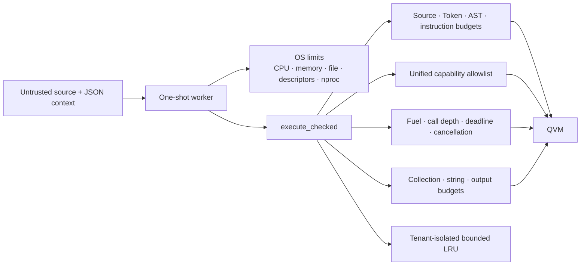
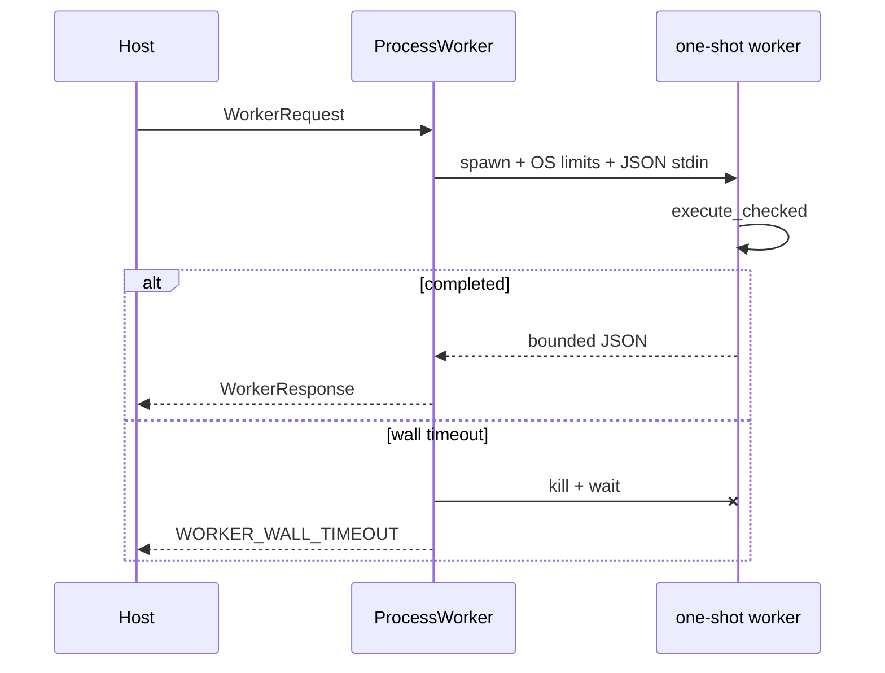

# QlExpress Rust Security Sandbox

> Java-compatible APIs remain available, but untrusted scripts must use `execute_checked` or the
> isolated worker.

QlExpress Rust supports loops, functions, lambdas, collections, macros, custom operators, and host
calls. Explicit Native registration narrows the capability surface; it is not by itself a hard
sandbox.



`QLOptions::default()` still mirrors Java: `timeout_millis = -1` and `max_arr_length = -1`.
`SandboxProfile::secure()` is an independent finite policy.

## Checked execution

```rust
use std::collections::HashMap;
use qlexpress::{
    Capability, CapabilityPolicy, DataValue, Express4Runner, QLOptions, SandboxProfile,
};

let runner = Express4Runner::new();
let mut profile = SandboxProfile::secure();
profile.tenant_id = "tenant-42".into();
profile.capability_policy = CapabilityPolicy::allow_only([
    Capability::Function("approved_price_lookup".into()),
]);

let result = runner.execute_checked(
    "price * 0.8",
    HashMap::from([("price".into(), DataValue::Double(100.0))]),
    &QLOptions::default(),
    &profile,
)?;
# Ok::<(), qlexpress::QLException>(())
```

The checked path:

1. validates the finite profile and source byte limit;
2. tokenizes with an allocation-time Token cap;
3. checks syntactic nesting, AST depth, and AST node count;
4. runs `CheckVisitor`;
5. validates the complete registered host capability surface and Native security mode;
6. compiles under a recursive instruction cap (including nested functions, Lambdas, loops, and
   try/catch bodies), optionally using a tenant LRU;
7. executes with fuel, call-depth, deadline, cancellation, collection, string, and output budgets.

The checked path rejects expression tracing when both engine and execution tracing are enabled.
Trace retention is intentionally unavailable until it has its own bounded storage policy.
Input context collections are charged cumulatively before execution.

## Capability policy

`CapabilityPolicy` defaults to deny-all and covers runtime functions, compile-time functions,
custom operators, aliases, macros, extension methods, and Native members. Built-in `List.filter`
and `List.map` also require an extension-method capability.

`execute_checked` accepts only `QLSecurityStrategy::Isolation` or a Native `WhiteList`. `Open` and
`BlackList` are rejected. Every Native whitelist member must also appear as a
`Capability::NativeMember`.

Capability validation audits the registered runner surface, not just the current script. An unused
but unauthorized registered function therefore rejects checked execution.

## Host-call deadline

`CustomFunction` receives `&mut dyn QContext`. Blocking implementations must read
`context.deadline()` and `context.cancellation_token()`, propagate the deadline to HTTP/database
clients, and check cancellation between blocking operations.

The QVM cannot preempt synchronous Rust code that ignores this contract. It detects expiry after
the call returns. Hostile inputs therefore require the worker boundary.

## Isolated process executor

The unpublished `qlexpress-process` crate provides a one-request-per-process JSON executor and a
`ProcessWorker` supervisor. The name deliberately describes the process boundary rather than
claiming to be a complete operating-system sandbox.



The worker has no registered host capabilities. It bounds stdin/stdout/stderr, applies Linux
`RLIMIT_AS`, and applies Unix CPU, file-size, file-descriptor, and process-count limits. On Linux
and macOS, `RLIMIT_NPROC` (default 256) prevents fork-bomb scripts from exhausting the PID table.
On macOS, lowering `RLIMIT_AS`/`RLIMIT_DATA` returns `EINVAL`; production must add a container,
VM, or launchd memory limit. The supervisor wall timeout and the remaining engine/Unix limits
still apply.

## Production requirements

- Add container CPU, memory, PID, network, and filesystem policies.
- Do not register filesystem, process, network, database, environment, or secret capabilities
  without independent authorization and tenant isolation.
- Record tenant, script digest, profile version, budget error code, cache statistics, and worker
  exit reason; avoid logging secrets or complete hostile payloads.
- Monitor `SANDBOX_*`, `WORKER_*`, abnormal exits, and signal termination separately.

This layer narrows in-process DoS and capability exposure, but OS/container isolation remains the
final trust boundary for adversarial scripts, native faults, allocator exhaustion, and host code
that ignores cancellation.
