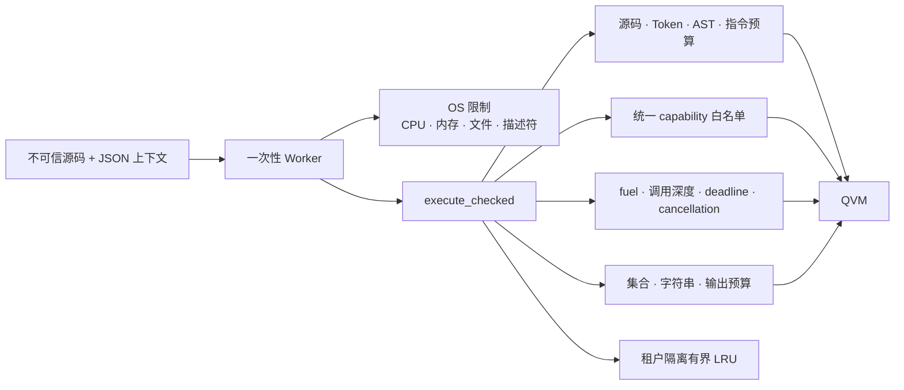
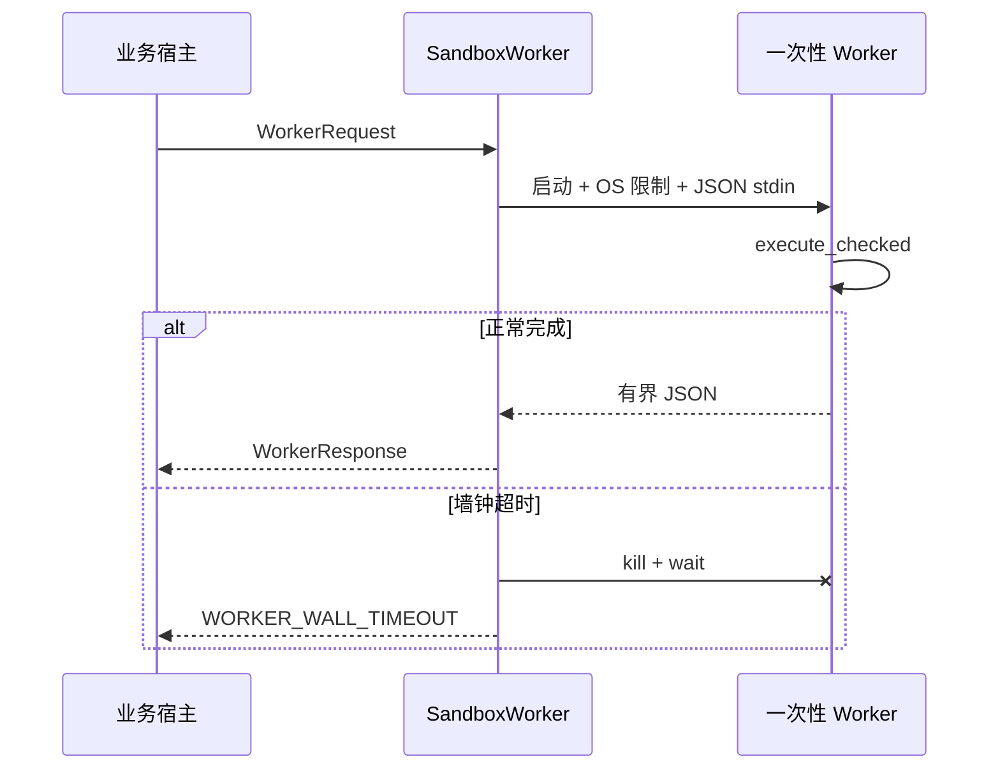

# QlExpress Rust 安全沙箱

> Java 兼容 API 保持可用，但不可信脚本必须使用 `execute_checked` 或独立 Worker。

QlExpress Rust 支持循环、函数、Lambda、集合、宏、自定义操作符和宿主调用。显式 Native
注册缩小了能力面，但它本身不等于硬沙箱。



`QLOptions::default()` 继续对齐 Java：`timeout_millis = -1`、
`max_arr_length = -1`。`SandboxProfile::secure()` 是独立的有限安全策略。

## 安全执行

```rust
use std::collections::HashMap;
use qlexpress::{
    Capability, CapabilityPolicy, DataValue, Express4Runner, QLOptions, SandboxProfile,
};

let runner = Express4Runner::new();
let mut profile = SandboxProfile::secure();
profile.tenant_id = "tenant-42".into();
profile.capability_policy = CapabilityPolicy::allow_only([
    Capability::Function("approved_price_lookup".into()),
]);

let result = runner.execute_checked(
    "price * 0.8",
    HashMap::from([("price".into(), DataValue::Double(100.0))]),
    &QLOptions::default(),
    &profile,
)?;
# Ok::<(), qlexpress::QLException>(())
```

安全路径依次完成：

1. 校验有限 Profile 和源码字节数；
2. 在词法分配时限制 Token 数；
3. 校验语法嵌套、AST 深度和节点数；
4. 强制执行 `CheckVisitor`；
5. 校验 Runner 完整注册能力面和 Native 安全模式；
6. 在递归指令预算内编译（包含嵌套函数、Lambda、循环和 try/catch 子体），并可使用租户隔离
   LRU；
7. 以 fuel、调用深度、deadline、取消、集合、字符串和输出预算执行。

安全入口会拒绝同时启用引擎与执行期表达式追踪；在 trace 具备独立有界存储策略前，不允许
保留无界追踪数据。输入上下文中的集合元素会在执行前累计计费。

## 统一能力白名单

`CapabilityPolicy` 默认拒绝全部宿主能力，覆盖运行期函数、编译期函数、自定义操作符、
别名、宏、扩展方法和 Native 成员。内建 `List.filter`、`List.map` 也必须显式授权。

`execute_checked` 只接受 `QLSecurityStrategy::Isolation` 或 Native `WhiteList`；
`Open`、`BlackList` 会被拒绝。Native 白名单中的成员还必须出现在
`Capability::NativeMember` 中。

校验对象是 Runner 完整注册面，而不是只检查当前脚本。因此注册了未授权但暂未使用的函数，
安全执行同样会拒绝，避免脚本或缓存变化后激活休眠能力。

## 宿主调用 deadline

`CustomFunction` 已接收 `&mut dyn QContext`。阻塞实现必须读取
`context.deadline()` 和 `context.cancellation_token()`，把期限传递给 HTTP、数据库客户端，
并在阻塞步骤之间检查取消状态。

QVM 无法抢占忽略该约定的同步 Rust 代码，只能在函数返回后发现超时。敌对输入必须经过独立
Worker。

## 独立 Worker

不发布到 crates.io 的 `qlexpress-sandbox-worker` 提供每进程单请求 JSON Worker 和
`SandboxWorker` 父进程监督器。



Worker 不注册任何宿主能力，限制 stdin/stdout/stderr，在 Linux 使用 `RLIMIT_AS`，并在 Unix
设置 CPU、文件大小和文件描述符限制。macOS 降低 `RLIMIT_AS`/`RLIMIT_DATA` 会返回
`EINVAL`，生产必须补充容器、虚拟机或 launchd 级内存限制；监督器墙钟限制和其它限制仍然
生效。

## 生产要求

- 额外配置容器 CPU、内存、PID、网络和文件系统策略。
- 文件、进程、网络、数据库、环境变量和密钥能力没有独立授权及租户隔离时不得注册。
- 记录租户、脚本摘要、Profile 版本、预算错误码、缓存统计和 Worker 退出原因；默认不要
  记录密钥或完整敌对请求。
- 分别监控 `SANDBOX_*`、`WORKER_*`、异常退出和信号终止。

该层显著缩小进程内 DoS 和能力暴露面，但对于敌对脚本、Native 故障、分配器耗尽和忽略取消
的宿主代码，操作系统/容器仍是最终信任边界。
