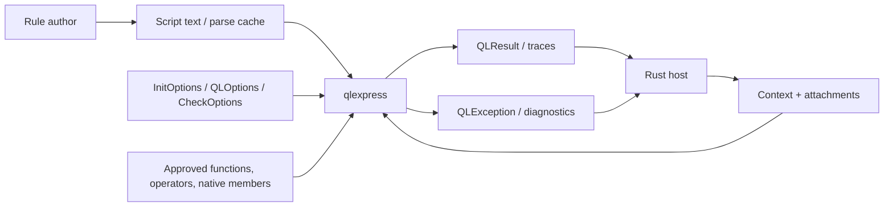
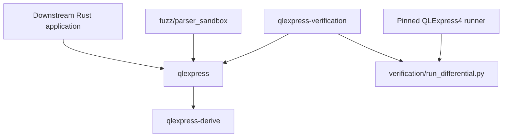
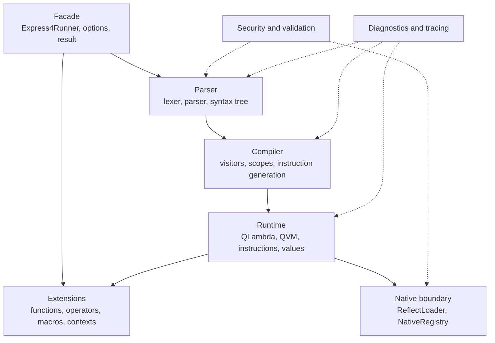
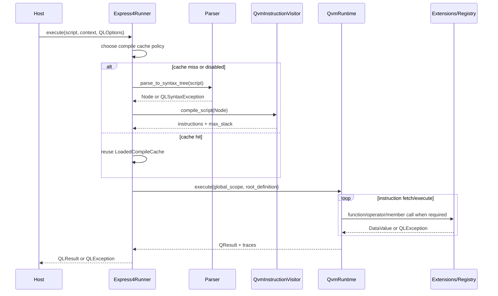
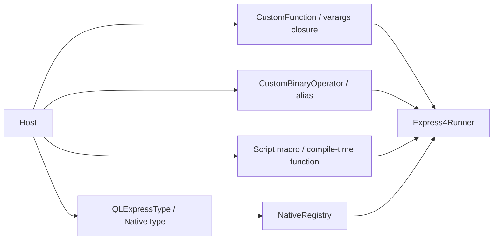
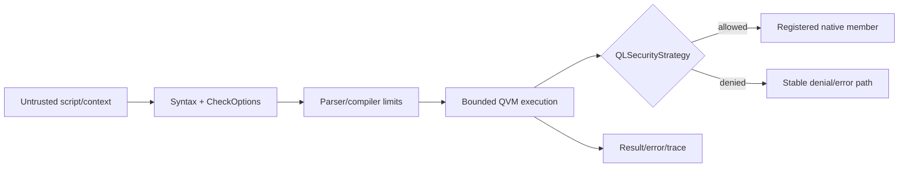
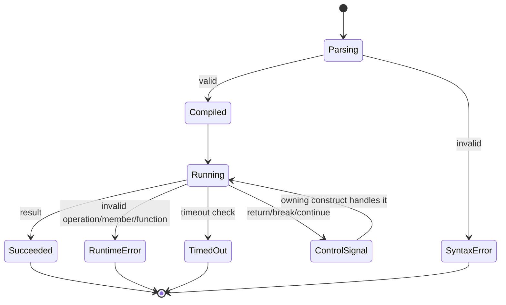
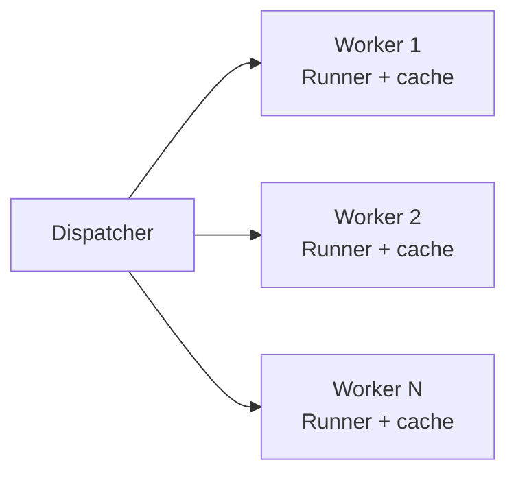
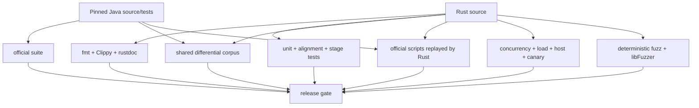
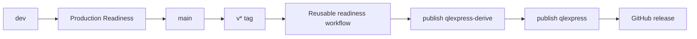

# QlExpress Rust Architecture

> **Purpose:** Define the verifiable architecture contract for QlExpress Rust.<br>
> **Architecture version:** 1.0<br>
> **Code baseline:** `v0.1.0-alpha.2`; documentation audit from the `dev` release candidate<br>
> **Upstream authority:** Alibaba QLExpress4 `4.2.0-beta@9065b9ac`<br>
> **Last verified:** 2026-07-30<br>
> **Status:** Current-state baseline, ready for review

[简体中文](qlexpress-Architecture.zh_CN.md) | [README](../README.md) |
[Usage Guide](Usage-Guide.md)

## 1. Executive summary

qlexpress is an in-process Rust library that transforms a script plus host context into a
`QLResult` or structured `QLException`. It preserves QLExpress4 behavior while replacing JVM-only
mechanisms with explicit Rust ownership, traits, enums, closures, and native registration.

```text
Host application
   │ script + context + execution policy
   ▼
┌───────────────────────────────────────────────────────────────┐
│ qlexpress                                                     │
│ facade → parse → compile → QLambda/QVM → result or error      │
│             │         │             ▲                         │
│             └─ cache ─┘     functions/operators/native types  │
└───────────────────────────────────────────────────────────────┘
   │ result + expression traces
   ▼
Host decision, telemetry, or downstream action
```

### Quality priorities

| Priority | Attribute | Current contract |
|:---:|:---|:---|
| P0 | Behavioral correctness | Differential and replay tests against a pinned Java baseline |
| P0 | Safe host boundary | Isolation by default; explicit native registration |
| P0 | Deterministic failure | Structured errors, bounded script options, no panic acceptance |
| P1 | Embeddability | No service or JVM required; library-level API |
| P1 | Extensibility | Functions, operators, macros, contexts, and native types |
| P1 | Performance | Compile caching and runner-per-worker reuse |

## 2. Scope and non-goals

### In scope

- lexical and syntactic analysis;
- syntax-tree validation and static dependency analysis;
- compilation to stack-oriented QVM instructions;
- QLambda scopes, closures, functions, control flow, values, and errors;
- explicit host functions, operators, native members, and security policy;
- parse-cache import/export and expression traces;
- repository-level compatibility and production-readiness verification.

### Out of scope

- Java ABI, bytecode, class loading, or JVM reflection compatibility;
- a network service, distributed scheduler, persistent store, or control plane;
- sharing one `Express4Runner` concurrently across threads;
- asserting production readiness for a host that has not replayed its real scripts and data;
- stable `1.0` API compatibility while the project remains `0.1.0-alpha.2`.

## 3. Evidence and implementation status

| Claim | Status | Evidence |
|:---|:---:|:---|
| Buildable/published workspace | Implemented | Cargo manifests; crates.io release |
| Java behavioral baseline | Pinned | Workspace metadata and CI checkout |
| Parser/compiler/QVM main path | Implemented | `Express4Runner`, visitor compiler, QVM source and tests |
| Host extension surface | Implemented | Runner registration APIs and derive fixtures |
| Runner-per-worker model | Verified | Concurrency and load harness |
| Repository safety gates | Verified | Deterministic fuzz and libFuzzer |
| Arbitrary host production readiness | Not claimed | Requires host-specific acceptance |
| Cross-platform matrix | Not claimed | CI currently runs on Ubuntu |

## 4. System context and trust boundary



The script and its context may be untrusted. The host application is responsible for selecting
allowed extensions, setting limits, and isolating the process. `NativeRegistry` is the principal
boundary between script values and host objects.

## 5. Workspace and dependency architecture



| Component | Responsibility | Published | Dependency rule |
|:---|:---|:---:|:---|
| `qlexpress` | Public API, parser, compiler, runtime, values, security | Yes | Does not depend on verification |
| `qlexpress-derive` | Procedural code generation for host structs | Yes | Compile-time only; no runtime discovery |
| `qlexpress-verification` | Acceptance CLI and business scenarios | No | May depend on the public facade |
| `verification/java` | Java differential runner | No | Fixed Maven dependency on QLExpress4 |
| `fuzz` | Coverage-guided parser/runtime safety target | No | Nightly/cargo-fuzz only |

The core crate has no Cargo feature matrix at this release; its published behavior is the default
behavior.

## 6. Internal layers



### Layer responsibilities

| Layer | Owns | Must not own |
|:---|:---|:---|
| Facade | Lifecycle, registration, cache selection, result mapping | Instruction semantics |
| Parser | Tokens, grammar, syntax tree, source locations | Runtime state |
| Compiler | Tree traversal, instructions, stack sizing, timeout checks | Host side effects |
| Runtime | Scope, stack, program counter, calls, control signals | Parsing |
| Extensions | Explicit custom behavior | Bypassing policy |
| Native boundary | Registered fields/methods/constructors and security checks | Arbitrary reflection |

## 7. Core execution flow



### Program-counter semantics

`run_instructions` executes the instruction at the current program counter. Ordinary results
advance by one. `Jump` applies the Java-compatible relative offset. `Return`, `Break`, and
`Continue` leave the current loop and propagate the control result to the owning construct.

Timeout checks are inserted during compilation after calls and at bounded instruction intervals;
they compare the runtime start timestamp with `QLOptions::timeout_millis`.

## 8. Compilation and cache ownership


- Cache key: exact script string.
- Owner: one `Express4Runner`.
- Value: `Rc<LoadedCompileCache>`.
- Mutation: `RefCell`; therefore the runner is intentionally single-threaded.
- Serializable cache: JSON model v1 with producer version, script, hash, instructions, and optional
  trace points.
- Binding: an imported `LoadedParseCache` is bound to the importing runner identity.

The Java implementation uses `ConcurrentHashMap<String, Future<QCompileCache>>`. Rust preserves
cache-hit behavior but does not reproduce cross-thread, single-flight compilation.

## 9. State, values, and consistency

| State | Owner | Lifetime | Concurrency model |
|:---|:---|:---|:---|
| Operator table | Runner | Runner | Configured through mutable runner access |
| Function tables | Runner / execution scope | Runner or call | `RefCell` / scope ownership |
| Compile cache | Runner | Runner | `RefCell<HashMap>` |
| Native registry | Runner/runtime | Runner | `Rc`, configured before execution sharing |
| Global/local variables | `QScope` hierarchy | Execution/call/block | Single-thread stack/scope |
| Operand stack | QLambda scope | Call | Fixed-size stack from compiler maximum |
| Expression traces | Runtime | Execution | Interior mutability, returned in `QLResult` |

`DataValue` maps Java-like scalar types and preserves reference semantics for lists, maps, arrays,
lambdas, and native objects with `Rc<RefCell<...>>`.

## 10. Extension model



`#[derive(QLExpressType)]` generates native type and field-access implementations for named,
non-generic structs. Helper attributes control type name, exposed fields, aliases, and skipped
fields. Methods and constructors remain explicit because a derive macro cannot inspect separate
Rust `impl` blocks.

## 11. Security architecture



| Control | Current behavior | Host obligation |
|:---|:---|:---|
| Native policy | Isolation is default | Prefer narrow allowlists |
| Operator/function validation | `CheckOptions` | Define accepted grammar per use case |
| Timeout | Cooperative QVM checks | Add request/process deadline |
| Array limit | `max_arr_length` | Also limit overall input and memory |
| Registry | Explicit members only | Audit registrations and closures |
| Fuzz | Deterministic + libFuzzer gates | Add real host types and corpus |

Opening native access is an explicit trust decision. Validation, security policy, and limits are
complementary controls rather than interchangeable guarantees.

## 12. Error and recovery model



`QLException` contains a kind, stable error code, source position, lexeme, reason, and optional
catchable value. A script failure does not mutate the compile cache. Host side effects inside
custom functions or native methods cannot be rolled back by the engine; such extensions need
their own idempotency and transaction policy.

## 13. Concurrency and resource model

The supported concurrency architecture is runner-per-worker:



Each worker configures its registry once and reuses its runner. Context, scopes, stacks, and traces
remain execution-local. This avoids shared mutable state and matches the acceptance harness.

The repository load threshold is a gate, not a universal SLA: zero execution errors, at least
100 operations/second, and p99 below 250 ms for its fixed script mix. Host-specific targets must be
remeasured on production-like hardware and data.

## 14. Verification architecture



The recorded evidence and commands live in [Production Acceptance](生产验收.md). Static source
mapping and tests establish repository behavior; they do not prove external deployment,
observability, or business-data correctness.

## 15. Packaging and release



The two published crates share an exact version. The facade depends on
`qlexpress-derive = "=0.1.0-alpha.2"`, so the derive crate must become available first.
Trusted Publishing is designed to use GitHub OIDC and the protected `release` environment.

## 16. Decisions and trade-offs

| ADR | Decision | Rationale | Consequence / reversal condition |
|:---|:---|:---|:---|
| ADR-001 | Preserve behavior, not Java internals | Rust should remain idiomatic and safe | Revisit only if an interoperability contract requires internals |
| ADR-002 | Explicit native registry replaces reflection | Auditable boundary; no JVM | More host registration code |
| ADR-003 | Unified `QLException` + kind | Natural `Result` propagation | Large error value accepted intentionally |
| ADR-004 | Runner-local `Rc`/`RefCell` | Java-like reference semantics with simple ownership | Runner is not cross-thread shareable |
| ADR-005 | Separate proc-macro crate | Rust proc-macro requirement and clean facade | Exact publication ordering |
| ADR-006 | Pinned upstream baseline | Reproducible parity | Upstream upgrades require an explicit migration |

## 17. Risks and next acceptance work

| Risk/gap | Current mitigation | Required next evidence |
|:---|:---|:---|
| Alpha API changes | Exact version pin | SemVer review and migration notes |
| No multi-OS CI claim | Ubuntu CI only | Linux/macOS/Windows target matrix |
| Host extensions may have side effects | Explicit registration | Host transaction/idempotency tests |
| Cooperative timeout is not hard isolation | QVM checks and fuzzing | Process sandbox/deadline for hostile inputs |
| Repository load mix differs from business traffic | Repeatable harness | Real scripts/data on target hardware |
| Local canary is not a deployment rollback | Deterministic simulation | Staging/production platform drill |

## 18. Source map

| Concern | Primary source |
|:---|:---|
| Facade and cache | `crates/qlexpress/src/express4_runner.rs` |
| Options | `init_options.rs`, `ql_options.rs`, `check_options.rs` |
| Parser/compiler | `crates/qlexpress/src/aparser/` |
| QVM | `runtime/qvm_runtime.rs`, `runtime/qlambda_inner.rs`, `runtime/instruction/` |
| Values and scopes | `runtime/data/`, `runtime/scope/`, `runtime/context/` |
| Native boundary | `runtime/native_registry.rs`, `runtime/reflect_loader.rs` |
| Derive | `crates/qlexpress-derive/src/` |
| Verification | `crates/qlexpress-verification/`, `verification/`, `fuzz/` |
| Java mappings | `语义迁移对照表.md`, `对象级对照表.md` |

---

**Document version:** 1.0<br>
**Created:** 2026-07-27<br>
**Last updated:** 2026-07-27<br>
**Status:** Ready for review
