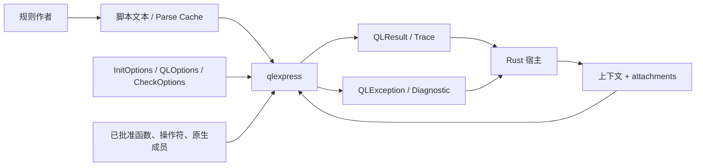
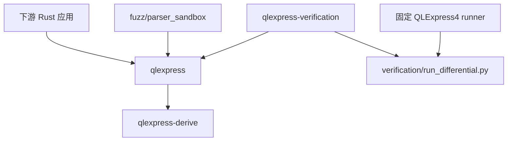
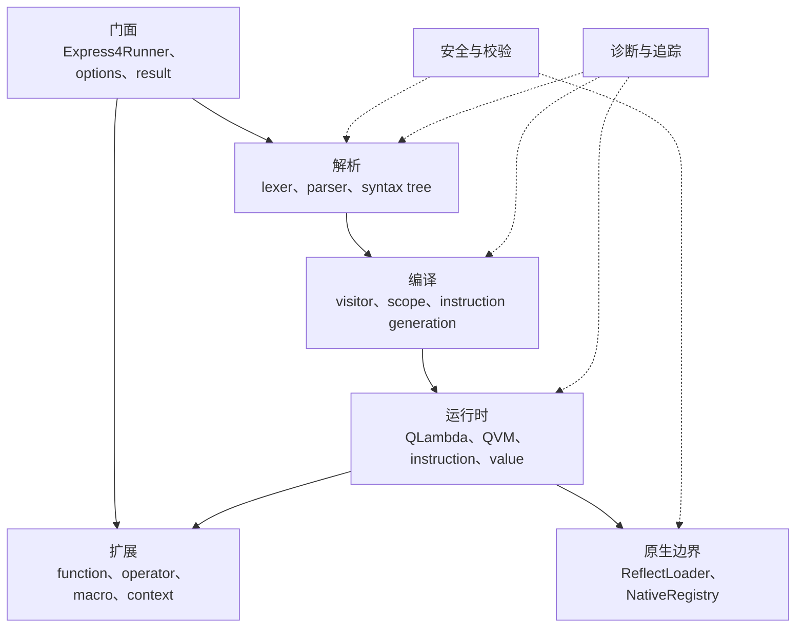
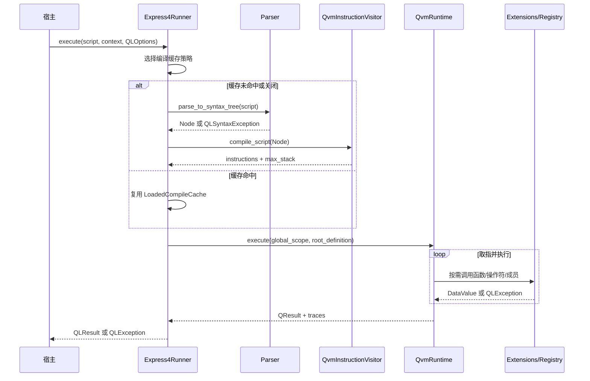
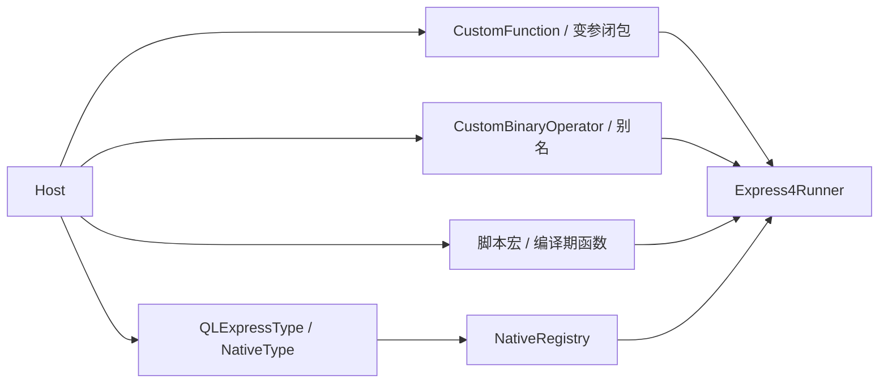
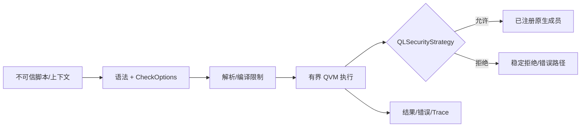
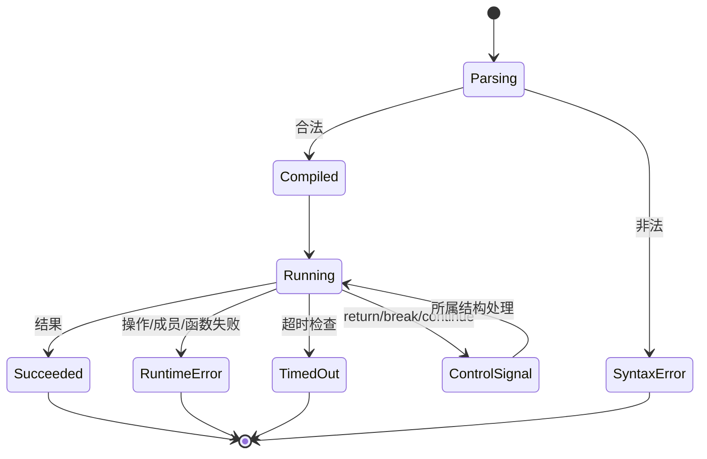
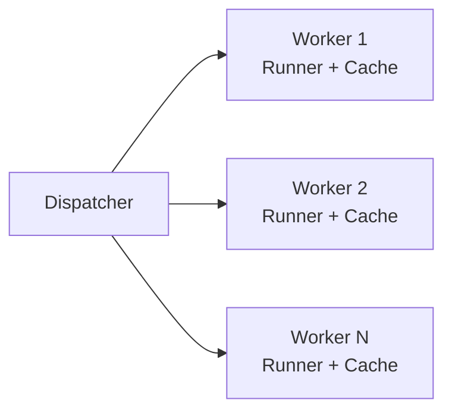
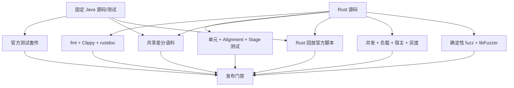
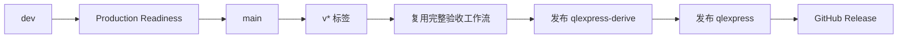

# QlExpress Rust 架构文档

> **文档目的**：定义 QlExpress Rust 可验证的架构合同。<br>
> **架构版本**：1.0<br>
> **代码基线**：`v0.1.0-alpha.1`；文档审计基于 `dev@246da0f`<br>
> **上游权威**：Alibaba QLExpress4 `4.2.0-beta@9065b9ac`<br>
> **最后核验**：2026-07-27<br>
> **状态**：当前态架构基线，待评审

[English](qlexpress-Architecture.md) | [README](../README.zh-CN.md) |
[使用指南](Usage-Guide.zh_CN.md)

## 1. 执行摘要

qlexpress 是一个进程内 Rust 库，将脚本和宿主上下文转换为 `QLResult` 或结构化
`QLException`。它保持 QLExpress4 行为语义，同时以显式所有权、trait、enum、闭包
和原生注册表替代 JVM 专属机制。

```text
宿主应用
   │ 脚本 + 上下文 + 执行策略
   ▼
┌───────────────────────────────────────────────────────────────┐
│ qlexpress                                                     │
│ 门面 → 解析 → 编译 → QLambda/QVM → 结果或错误                │
│          │        │              ▲                            │
│          └─ 缓存 ─┘      函数/操作符/原生类型                 │
└───────────────────────────────────────────────────────────────┘
   │ 结果 + 表达式追踪
   ▼
宿主决策、监控或下游动作
```

### 质量属性优先级

| 优先级 | 属性 | 当前合同 |
|:---:|:---|:---|
| P0 | 行为正确性 | 针对固定 Java 基线执行差分与回放 |
| P0 | 宿主边界安全 | 默认隔离，显式注册原生成员 |
| P0 | 确定性失败 | 结构化错误、脚本选项限制、panic 零容忍 |
| P1 | 可嵌入 | 不依赖独立服务和 JVM |
| P1 | 可扩展 | 函数、操作符、宏、上下文和原生类型 |
| P1 | 性能 | 编译缓存与每 worker 长期复用 runner |

## 2. 范围与非目标

### 范围内

- 词法和语法分析；
- 语法树校验与静态依赖分析；
- 编译为栈式 QVM 指令；
- QLambda 作用域、闭包、函数、控制流、值和错误；
- 显式宿主函数、操作符、原生成员和安全策略；
- Parse cache 导入/导出与表达式追踪；
- 仓库级兼容和生产就绪验收。

### 非目标

- Java ABI、字节码、类加载或 JVM 反射兼容；
- 网络服务、分布式调度器、持久化存储或控制面；
- 在线程间并发共享同一个 `Express4Runner`；
- 未回放真实脚本和数据时宣称业务宿主生产可用；
- `0.1.0-alpha.1` 阶段承诺稳定 `1.0` API。

## 3. 证据与实现状态

| 声明 | 状态 | 证据 |
|:---|:---:|:---|
| Workspace 可构建且已发布 | 已实现 | Cargo Manifest 与 crates.io 版本 |
| Java 行为基线 | 已固定 | Workspace metadata 与 CI checkout |
| 解析/编译/QVM 主链 | 已实现 | `Express4Runner`、Visitor、QVM 源码和测试 |
| 宿主扩展面 | 已实现 | runner 注册 API 与 derive fixtures |
| 每 worker 一个 runner | 已验证 | 并发和负载验收工具 |
| 仓库安全门禁 | 已验证 | 确定性 fuzz 与 libFuzzer |
| 任意宿主生产可用 | 未声明 | 需要宿主专项验收 |
| 跨平台矩阵 | 未声明 | 当前 CI 只运行于 Ubuntu |

## 4. 系统上下文与信任边界



脚本和上下文可能不可信。宿主应用负责选择允许的扩展、设置资源限制和隔离进程。
`NativeRegistry` 是脚本值与宿主对象之间的主要边界。

## 5. Workspace 与依赖架构



| 组件 | 职责 | 发布 | 依赖规则 |
|:---|:---|:---:|:---|
| `qlexpress` | 公共 API、解析、编译、运行时、值和安全 | 是 | 不依赖 verification |
| `qlexpress-derive` | 为宿主结构体生成过程宏代码 | 是 | 仅编译期；不做运行时发现 |
| `qlexpress-verification` | 验收 CLI 与业务场景 | 否 | 只通过公共门面依赖核心 |
| `verification/java` | Java 差分执行器 | 否 | 固定 Maven QLExpress4 版本 |
| `fuzz` | 覆盖引导解析器/运行时安全目标 | 否 | 仅 Nightly/cargo-fuzz |

当前版本没有 Cargo feature 矩阵，已发布行为就是默认行为。

## 6. 内部分层



### 分层职责

| 层 | 拥有 | 不应拥有 |
|:---|:---|:---|
| 门面 | 生命周期、注册、缓存选择、结果映射 | 指令语义 |
| 解析 | Token、语法、语法树、源码位置 | 运行时状态 |
| 编译 | 语法树遍历、指令、栈大小、超时检查 | 宿主副作用 |
| 运行时 | 作用域、栈、程序计数器、调用、控制信号 | 语法解析 |
| 扩展 | 显式自定义行为 | 绕过安全策略 |
| 原生边界 | 注册字段/方法/构造器与安全检查 | 任意反射 |

## 7. 核心执行流程



### 程序计数器语义

`run_instructions` 执行当前程序计数器对应的指令。普通结果前进一步，`Jump` 使用
与 Java 对齐的相对偏移；`Return`、`Break`、`Continue` 退出当前循环，并将控制
结果交给所属结构处理。

编译器在调用后和有界指令间隔插入超时检查；检查运行时开始时间与
`QLOptions::timeout_millis`。

## 8. 编译与缓存所有权


- 缓存键：完整脚本文本。
- 所有者：单个 `Express4Runner`。
- 缓存值：`Rc<LoadedCompileCache>`。
- 可变性：`RefCell`，因此 runner 明确为单线程模型。
- 可序列化缓存：JSON 模型 v1，包含生产者版本、脚本、哈希、指令和可选 trace point。
- 绑定：导入后的 `LoadedParseCache` 绑定到执行导入的 runner 身份。

Java 使用 `ConcurrentHashMap<String, Future<QCompileCache>>`。Rust 保留缓存命中
行为，但不复制跨线程 single-flight 编译。

## 9. 状态、值与一致性

| 状态 | 所有者 | 生命周期 | 并发模型 |
|:---|:---|:---|:---|
| 操作符表 | Runner | Runner | 通过可变 runner 配置 |
| 函数表 | Runner / 执行作用域 | Runner 或调用 | `RefCell` / 作用域所有权 |
| 编译缓存 | Runner | Runner | `RefCell<HashMap>` |
| 原生注册表 | Runner/Runtime | Runner | `Rc`，执行共享前完成配置 |
| 全局/局部变量 | `QScope` 层级 | 执行/调用/块 | 单线程栈与作用域 |
| 操作数栈 | QLambda scope | 调用 | 按编译期最大值创建固定栈 |
| 表达式追踪 | Runtime | 单次执行 | 内部可变，随 `QLResult` 返回 |

`DataValue` 映射 Java 风格标量；列表、Map、数组、Lambda 和宿主对象通过
`Rc<RefCell<...>>` 保持引用语义。

## 10. 扩展模型



`#[derive(QLExpressType)]` 为具名字段、非泛型结构体生成原生类型和字段访问实现。
辅助属性控制类型名、字段暴露、别名和跳过字段。派生宏无法检查独立 Rust `impl`
块，因此方法和构造器仍需显式注册。

## 11. 安全架构



| 控制 | 当前行为 | 宿主义务 |
|:---|:---|:---|
| 原生策略 | 默认隔离 | 优先最小白名单 |
| 操作符/函数校验 | `CheckOptions` | 按场景定义可接受语法 |
| 超时 | QVM 协作检查 | 增加请求/进程 deadline |
| 数组限制 | `max_arr_length` | 同时限制总输入和内存 |
| 注册表 | 仅显式成员 | 审计注册项和闭包 |
| Fuzz | 确定性 + libFuzzer | 加入真实宿主类型和语料 |

开放原生访问是显式信任决策。静态校验、安全策略和资源限制是互补控制，不能互相
替代。

## 12. 错误与恢复模型



`QLException` 包含类别、稳定错误码、源码位置、词素、原因和可选 catch 对象。
脚本执行失败不会修改编译缓存。自定义函数或原生方法产生的宿主副作用无法由引擎
回滚，扩展自身必须定义幂等和事务策略。

## 13. 并发与资源模型

支持的并发架构是每 worker 一个 runner：



每个 worker 一次性配置注册表并长期复用 runner；上下文、作用域、栈和 trace 保持
执行局部。这避免共享可变状态，也与仓库验收工具一致。

仓库负载门限只是门禁，不是通用 SLA：固定脚本组合要求执行错误为 0、吞吐至少
100 ops/s、p99 低于 250 ms。业务宿主必须在生产相近硬件和数据上重新测量。

## 14. 验证架构



已记录证据和命令见[生产验收](生产验收.md)。源码映射和测试证明仓库行为，但不证明
外部部署、可观测性和业务数据正确性。

## 15. 打包与发布



两个已发布 crate 使用完全相同的版本。门面依赖
`qlexpress-derive = "=0.1.0-alpha.1"`，所以必须先发布 derive。Trusted
Publishing 的设计使用 GitHub OIDC 和受保护的 `release` Environment。

## 16. 架构决策与取舍

| ADR | 决策 | 原因 | 后果/反转条件 |
|:---|:---|:---|:---|
| ADR-001 | 保持行为，不复制 Java 内部实现 | Rust 应保持惯用和安全 | 只有互操作合同要求内部一致时重审 |
| ADR-002 | 显式注册表替代反射 | 可审计、无 JVM | 宿主注册代码增加 |
| ADR-003 | 统一 `QLException` + kind | 自然使用 `Result` 传播 | 有意接受较大的错误值 |
| ADR-004 | Runner 局部 `Rc`/`RefCell` | 简化所有权并保持引用语义 | runner 不可跨线程共享 |
| ADR-005 | 独立过程宏 crate | Rust proc-macro 要求和清晰门面 | 发布必须严格排序 |
| ADR-006 | 固定上游基线 | 差分结果可复现 | 上游升级必须显式迁移 |

## 17. 风险与后续验收

| 风险/差距 | 当前缓解 | 下一步证据 |
|:---|:---|:---|
| Alpha API 变化 | 固定精确版本 | SemVer 评审和迁移说明 |
| 无多操作系统 CI 声明 | 仅 Ubuntu CI | Linux/macOS/Windows target 矩阵 |
| 宿主扩展可能有副作用 | 显式注册 | 宿主事务/幂等测试 |
| 协作式超时不是强隔离 | QVM 检查与 fuzz | 恶意输入使用进程沙箱/deadline |
| 仓库负载不同于业务流量 | 可重复工具 | 目标硬件上的真实脚本/数据 |
| 本地灰度不等于部署回滚 | 确定性模拟 | Staging/生产发布平台演练 |

## 18. 源码导航

| 关注点 | 主要源码 |
|:---|:---|
| 门面与缓存 | `crates/qlexpress/src/express4_runner.rs` |
| 选项 | `init_options.rs`、`ql_options.rs`、`check_options.rs` |
| 解析/编译 | `crates/qlexpress/src/aparser/` |
| QVM | `runtime/qvm_runtime.rs`、`runtime/qlambda_inner.rs`、`runtime/instruction/` |
| 值与作用域 | `runtime/data/`、`runtime/scope/`、`runtime/context/` |
| 原生边界 | `runtime/native_registry.rs`、`runtime/reflect_loader.rs` |
| 派生宏 | `crates/qlexpress-derive/src/` |
| 验收 | `crates/qlexpress-verification/`、`verification/`、`fuzz/` |
| Java 对照 | `语义迁移对照表.md`、`对象级对照表.md` |

---

**文档版本**：1.0<br>
**创建日期**：2026-07-27<br>
**最后更新**：2026-07-27<br>
**文档状态**：待评审
