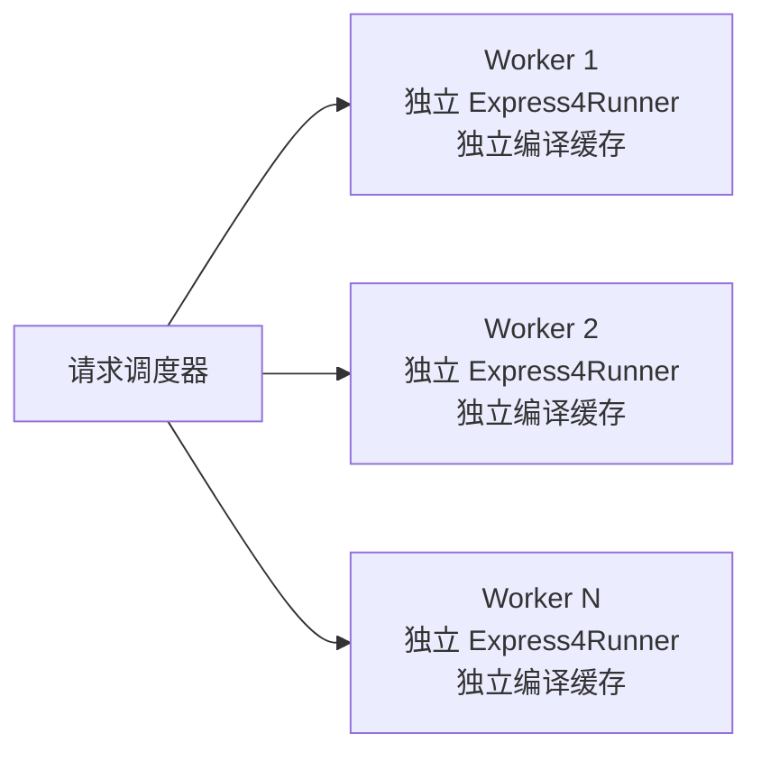
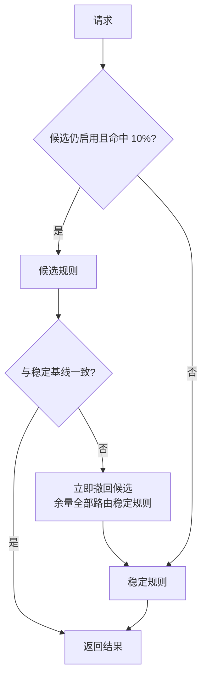

# QlExpress Rust 生产验收

本文记录可重复执行的仓库级生产验收。它为迁移实现、Java/Rust 语义、
线程模型、安全边界、负载和本地回滚机制提供分层证据；真实业务集群的部署、
监控、容量与回滚仍需由具体宿主环境执行。尤其是覆盖率只表明 Rust 路径被
测试执行，绝不构成 Java/Rust 功能或语言语义一致性的证明。

## 自动验收矩阵

| 验收域 | 命令 | 通过标准 |
|---|---|---|
| Java/Rust 差分 | `python3 verification/run_differential.py --java-repo <QLExpress>` | 所有用例类型、值、错误码、位置和 trace 数量一致 |
| Java 官方脚本回放 | Java `TestSuiteRunner#suiteTest` + Rust `replay` | Java 228/228；Rust 对同一物理目录的 independent 151/151 |
| 并发模型 | `cargo run -p qlexpress-verification -- concurrency 8 2000` | 线程独立 Runner；16,000 次执行 0 错误 |
| 负载 | `cargo run -p qlexpress-verification -- load 15 8` | 0 错误且 p99 < 250ms |
| 确定性安全 fuzz | `cargo run -p qlexpress-verification -- security-fuzz 25000` | 0 panic、0 隔离绕过 |
| libFuzzer | `cargo fuzz run parser_sandbox <temp-corpus> -- -max_total_time=30` | 0 crash |
| 业务宿主 | `cargo run -p qlexpress-verification -- business-host` | 注册订单对象，三类风控决策全部正确 |
| 灰度回滚 | `cargo run -p qlexpress-verification -- canary` | 正常候选不回滚；错误候选首次不一致后回滚且余量 0 错误 |

> 只有 Java/Rust 差分、原始脚本回放及其宿主状态/副作用断言，才是跨语言
> 一致性的直接证据。覆盖率、fuzz、负载和静态质量门禁仅补充证明 Rust 实现
> 被执行、健壮或可维护，不能替代跨语言对照。

## 2026-08-08 本轮验收证据

| 验收域 | 实际结果 |
|---|---|
| Java 全量 Maven | Corretto JDK 17.0.20；225 次执行，0 failed / error / skipped |
| 源测试接受层 | 223/223 映射通过；211 EXACT、12 ADAPTED；Java 225 次执行与 1,111 个唯一 Rust 可执行测试名交叉校验 |
| 测试资源 | `src/test/resources` 236/236 原始字节一致；其中 testsuite `.ql` 228/228 原始字节一致 |
| Java/Rust 自动差分 | 295/295 完全一致，0 mismatch / missing |
| Java 脚本回放 | Rust 直接读取 Java 物理目录，151/151 通过 |
| Rust 全工作区 | fmt、check、all-features、clippy `-D warnings`、test、rustdoc `-D warnings` 全通过 |
| 并发/安全 | 8 × 2,000 = 16,000 次执行零错误；25,000 安全输入零 panic、零隔离绕过 |
| libFuzzer | parser sandbox 31 秒、99,644 runs，0 crash / artifact；运行后清理 1,522 个本轮生成的临时 corpus，保留 5 个仓库基线种子 |
| 业务宿主/回滚 | 风控 3/3；错误候选首次差异即回滚，回滚后 0 错误 |
| 15 秒负载 | 128,943 次，0 错误，8,596.20 ops/s，p99 5.081 ms |
| 核心覆盖率 | 行 26,383/29,795 = 88.55%；分支 2,699/3,536 = 76.33% |
| workspace 覆盖率 | 行 28,570/32,962 = 86.68%；分支 2,825/3,712 = 76.10% |
| 结构审计 | 543 个 Rust 文件；0 error、0 warning、0 超 800 行；35 个 501–800 行文件完成职责内聚复核 |

覆盖率报告位于 `target/verification/coverage/workspace.json` 和
`target/verification/coverage/workspace-branch.json`。源测试机器证据位于
`docs/source-test-parity.json` 与 `docs/verification/runs/`。

## 2026-07-30 本轮逐项验收证据

| 验收域 | 实际结果 |
|---|---|
| Java 全量 Maven | Corretto JDK 17.0.20，225 次执行，0 failed / 0 error / 0 skipped |
| Java 测试方法台账 | 223 个方法逐项核对：210 EXACT、13 ADAPTED、0 PARTIAL、0 MISSING |
| Java 官方脚本 | `TestSuiteRunner#suiteTest`：228/228 通过 |
| Java/Rust 自动差分 | 50/50 完全一致，0 mismatch / 0 missing |
| Rust 真实脚本回放 | 读取 Java `src/test/resources`：151/151 通过 |
| Rust stable 全工作区 | workspace/all-features、clippy `-D warnings`、rustdoc `-D warnings` 全通过 |
| Rust MSRV | Rust 1.85.0 workspace/all-features check 与全测试通过 |
| 并发模型 | 8 线程 × 1,000 次 = 8,000 次，0 错误，确定性 checksum 170634724000 |
| 15 秒负载 | 165,963 次，0 错误，11,064.20 ops/s，p99 4.074ms |
| 确定性安全 fuzz | 10,000 次，0 panic，0 isolation bypass |
| libFuzzer | 两轮约 30 秒覆盖引导运行及额外 1,000 runs，0 crash、0 artifact |
| 业务宿主 | 3/3 风控决策通过 |
| 灰度回滚 | 1,000 请求；正常候选 0 mismatch，故障候选首次差异即回滚，回滚后 0 错误 |
| 核心覆盖率 | 行 21,667/24,822 = 87.29%；分支 2,346/3,118 = 75.24% |
| workspace 覆盖率 | 行 21,948/25,843 = 84.93%；分支 2,378/3,164 = 75.16% |
| 结构红线审计 | 299 个生产 Rust 文件；0 error、0 warning、0 stub/compat/wildcard-import 缺口 |
| 公开 API 注释 | `-D missing-docs` 与 Java 来源邻近性严格审计均为 0 告警 |

覆盖率机器可读报告位于
`target/verification/coverage/workspace.json` 和
`target/verification/coverage/workspace-branch.json`；HTML 报告位于
`target/verification/coverage/html/html/index.html`。`target/` 不进入版本库，
CI 应将其作为 artifact 保存。

## 2026-08-05 当前差分复核

| 验收域 | 实际结果 |
|---|---|
| Java/Rust 自动差分 | `differential.jsonl` 295/295 一致，0 mismatch / 0 missing；其中 41 项直接调用类型化 `NumberMath` 门面，74 项逐方法调用五个具体数值域，41 项覆盖 `BaseBinaryOperator`，45 项直接覆盖 `OperatorManager` 注册、替换、查找、别名、优先级、未知词素 NPE 及适配器执行，2 项直接覆盖 `DelegateQContext` 的 19 个构造/公开方法及 `QScope` 的 12 个接口方法、状态副作用和全局关闭异常，1 项直接覆盖 `FixedSizeStack`/`Parameters` 的 10 个方法及 Java 原数组窗口覆盖副作用，1 项直接覆盖 `QRuntime`/`QvmRuntime`/`QContext` 的 11 个方法、对象身份和附件双向写穿，1 项直接覆盖 `ExceptionTable` 的 3 个构造/公开方法、声明顺序、父类 catch 和 finally，1 项直接覆盖 `BatchAddFunctionResult` 的 3 个方法、列表顺序、隔离性和可变写回，1 项直接覆盖 `QLFunctionalVarargs` 的空参数、异构参数顺序、null 参数及 null 返回值，3 项直接覆盖 LSP `Position`、`Range`、`Diagnostic` 的 13 个成员、原始坐标与可空引用，1 项直接覆盖 `ExistStack` 与三个同构私有实现的 16 个方法、null 名称、父链和根 pop，1 项直接覆盖 `MacroDefine` 的 3 个成员、共享列表双向写回与 null，1 项直接覆盖 `UserDefineException` 的 3 个成员、枚举值和 null 构造参数，1 项直接覆盖 `QLSecurityStrategy` 与四个 `Strategy*` 的 13 个成员、工厂、单例、null Member、共享 Set 和异常类，1 项直接覆盖 `QLStringUtils` 的 2 个方法、UTF-16 下标、未配对代理项、转义和越界异常；统一比较结果类型、值、身份关系、NaN/Infinity、错误码与错误原因 |
| 已知直接差分 | 无；原未知词素 `precedence` 的 Java NPE/Rust None 差异已按 Java 当前实现修复并迁入正式差分集，历史分类文件仅保留说明注释 |
| Java trace 基线缺陷 | `java-trace-baseline-failures.jsonl` 的 map literal + UTF-16 surrogate key 在 Java 4.2.0-beta trace 阶段可复现 NPE；不计入通过语料，也不视为 Rust 已兼容该缺陷 |
| nightly 辅助覆盖率复核 | workspace 行 27,221/32,674=83.31%、函数 3,155/3,733=84.52%、分支 2,859/3,808=75.08%；核心行 26,707/30,257=88.27%、核心函数 3,099/3,508=88.34%、核心分支 2,817/3,734=75.44%；全量测试通过；只用于定位未触达 Rust 分支，不证明、也不参与跨语言功能一致性判定 |

## 2026-07-29 本轮复验证据

| 验收域 | 实际结果 |
|---|---|
| Java Maven | JDK 17，225 passed / 0 failed |
| Java/Rust 差分 | 50/50 完全一致，0 mismatch / 0 missing |
| Rust 读取 Java independent 物理脚本 | 151/151 通过 |
| Rust 全工作区 | 803 个 `#[test]` 静态清单；全量及 doc-test 0 failed / 0 ignored |
| 并发 | runner-per-worker，8 线程 × 2,000 次 = 16,000 次，0 错误 |
| 15 秒负载 | 152,107 次，0 错误，10,140.47 ops/s，p99 4.859ms |
| 确定性安全 fuzz | 25,000 次，0 panic，0 isolation bypass |
| libFuzzer | nightly + ASan，31 秒 76,997 runs，0 crash |
| 业务宿主 | 3/3 风控决策通过 |
| 灰度回滚 | 正常候选 0 mismatch；故障候选首次差异后回滚，回滚后 0 错误 |
| 当时核心行覆盖率 | cargo-llvm-cov 20,217 / 23,787 = 84.99%；仅作为 Rust 路径执行快照，不与 Java 覆盖率比较功能完成度 |

`cargo-fuzz` 依赖 nightly 的 `-Zsanitizer`；本地和 CI 必须使用
`cargo +nightly fuzz ...`，不能在 stable 上把构建失败误判为目标代码失败。

## 2026-07-27 本地执行证据

| 验收域 | 实际结果 |
|---|---|
| Java/Rust 差分 | 50/50 完全一致，0 mismatch |
| Java 官方 TestSuiteRunner | 228/228 通过 |
| Rust 读取 Java independent 物理脚本 | 151/151 通过 |
| 并发 | 8 线程 × 2,000 次 = 16,000 次，0 错误 |
| 60 秒 soak | 713,932 次，0 错误，11,898.87 ops/s，p99 3.460ms |
| soak 资源 | max RSS 194,134,016 bytes；0 swap |
| 确定性安全 fuzz | 25,000 次，0 panic，0 isolation bypass |
| libFuzzer | 31 秒，159,098 runs，0 crash |
| 业务宿主 | 3/3 风控决策通过 |
| 灰度回滚 | 正常候选未回滚；故障候选首次差异后回滚，余量 0 错误 |

## Java/Rust 自动差分

`verification/corpus/differential.jsonl` 是两端共享语料。Java 执行器固定依赖
`com.alibaba:qlexpress4:4.2.0-beta`，Rust 执行器依赖当前工作区。两端将结果
规范化为 JSONL 后比较以下字段：

- 成功结果的 Java 风格类型和值；
- 失败结果的稳定错误码、行号和列号；
- expression trace 数量；
- 用例集合完整性，任一侧缺失即失败。

Java 基线固定为提交
`9065b9ac5d985dcd02e627239aa9cdb78fb2f7f3`，避免上游变化污染差分结果。

> 基线例外：`verification/corpus/java-trace-baseline-failures.jsonl` 单独记录 Java
> 4.2.0-beta 在 trace map literal 场景的可复现 `NullPointerException`。该文件不属于通过
> 语料，也不构成 Rust 兼容性通过证据；详见 `verification/corpus/README.md`。

## 并发模型

`Express4Runner` 内部使用 `Rc`/`RefCell`，不声明为 `Send`/`Sync`，因此验收
模型明确为：

禁止跨线程共享同一个 Runner。宿主应在每个工作线程启动时创建 Runner，
完成 `NativeRegistry` 注册后在该线程内长期复用。并发验收同时验证线程间
输入隔离、线程内缓存复用和确定性校验和。

## 安全 fuzz

安全验收分为两层：

1. 固定种子的结构化变异器生成运算符、控制流、构造器、字段和方法访问组合，
   在隔离策略下执行，并断言敏感宿主对象从未被调用。
2. `cargo-fuzz`/libFuzzer 对任意字节输入进行覆盖引导 fuzz，限制脚本长度、
   单次执行超时和数组长度，任何 panic 都视为失败。

## 业务宿主与灰度回滚

业务宿主样例以订单风控为边界：宿主通过 `#[derive(QLExpressType)]` 注册订单
对象，脚本返回 `PASS`、`REVIEW` 或 `REJECT`。这验证注册表、上下文、字段读取、
编译缓存和结果映射的完整链路。

灰度演练采用确定性 10% 路由：

本地演练会分别执行正确候选和故障候选，验证“不误回滚”和“首次差异后回滚”
两条路径。它不替代生产发布平台、真实指标和人工审批。

## 真实生产环境仍需完成

- 使用真实 `NativeRegistry`、业务脚本和脱敏业务数据执行回放；
- 按实际 CPU/内存/线程数重新标定吞吐和 p95/p99 门限；
- 接入生产指标、告警、审计日志和发布平台；
- 在真实 staging/canary 集群执行部署与回滚，并保留变更单和观测证据。
