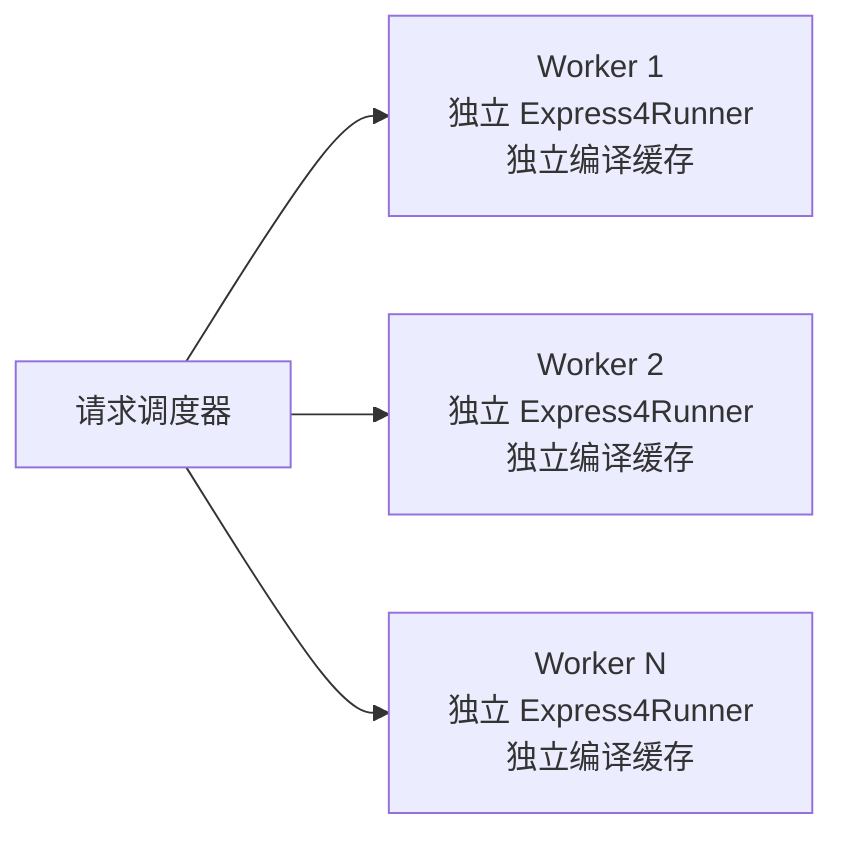
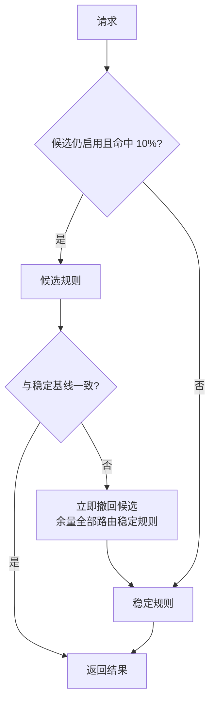

# qlexpress-rust 生产验收

本文记录可重复执行的仓库级生产验收。它证明迁移实现、Java/Rust 语义、
线程模型、安全边界、负载和本地回滚机制；真实业务集群的部署、监控、
容量与回滚仍需由具体宿主环境执行。

## 自动验收矩阵

| 验收域 | 命令 | 通过标准 |
|---|---|---|
| Java/Rust 差分 | `python3 verification/run_differential.py --java-repo <QLExpress>` | 所有用例类型、值、错误码、位置和 trace 数量一致 |
| Java 官方脚本回放 | Java `TestSuiteRunner#suiteTest` + Rust `replay` | Java 228/228；Rust 对同一物理目录的 independent 151/151 |
| 并发模型 | `cargo run -p qlexpress-verification -- concurrency 8 2000` | 线程独立 Runner；16,000 次执行 0 错误 |
| 负载 | `cargo run -p qlexpress-verification -- load 15 8` | 0 错误且 p99 < 250ms |
| 确定性安全 fuzz | `cargo run -p qlexpress-verification -- security-fuzz 25000` | 0 panic、0 隔离绕过 |
| libFuzzer | `cargo fuzz run parser_sandbox <temp-corpus> -- -max_total_time=30` | 0 crash |
| 业务宿主 | `cargo run -p qlexpress-verification -- business-host` | 注册订单对象，三类风控决策全部正确 |
| 灰度回滚 | `cargo run -p qlexpress-verification -- canary` | 正常候选不回滚；错误候选首次不一致后回滚且余量 0 错误 |

## 2026-07-27 本地执行证据

| 验收域 | 实际结果 |
|---|---|
| Java/Rust 差分 | 50/50 完全一致，0 mismatch |
| Java 官方 TestSuiteRunner | 228/228 通过 |
| Rust 读取 Java independent 物理脚本 | 151/151 通过 |
| 并发 | 8 线程 × 2,000 次 = 16,000 次，0 错误 |
| 60 秒 soak | 713,932 次，0 错误，11,898.87 ops/s，p99 3.460ms |
| soak 资源 | max RSS 194,134,016 bytes；0 swap |
| 确定性安全 fuzz | 25,000 次，0 panic，0 isolation bypass |
| libFuzzer | 31 秒，159,098 runs，0 crash |
| 业务宿主 | 3/3 风控决策通过 |
| 灰度回滚 | 正常候选未回滚；故障候选首次差异后回滚，余量 0 错误 |

## Java/Rust 自动差分

`verification/corpus/differential.jsonl` 是两端共享语料。Java 执行器固定依赖
`com.alibaba:qlexpress4:4.2.0-beta`，Rust 执行器依赖当前工作区。两端将结果
规范化为 JSONL 后比较以下字段：

- 成功结果的 Java 风格类型和值；
- 失败结果的稳定错误码、行号和列号；
- expression trace 数量；
- 用例集合完整性，任一侧缺失即失败。

Java 基线固定为提交
`9065b9ac5d985dcd02e627239aa9cdb78fb2f7f3`，避免上游变化污染差分结果。

## 并发模型

`Express4Runner` 内部使用 `Rc`/`RefCell`，不声明为 `Send`/`Sync`，因此验收
模型明确为：

禁止跨线程共享同一个 Runner。宿主应在每个工作线程启动时创建 Runner，
完成 `NativeRegistry` 注册后在该线程内长期复用。并发验收同时验证线程间
输入隔离、线程内缓存复用和确定性校验和。

## 安全 fuzz

安全验收分为两层：

1. 固定种子的结构化变异器生成运算符、控制流、构造器、字段和方法访问组合，
   在隔离策略下执行，并断言敏感宿主对象从未被调用。
2. `cargo-fuzz`/libFuzzer 对任意字节输入进行覆盖引导 fuzz，限制脚本长度、
   单次执行超时和数组长度，任何 panic 都视为失败。

## 业务宿主与灰度回滚

业务宿主样例以订单风控为边界：宿主通过 `#[derive(QLExpressType)]` 注册订单
对象，脚本返回 `PASS`、`REVIEW` 或 `REJECT`。这验证注册表、上下文、字段读取、
编译缓存和结果映射的完整链路。

灰度演练采用确定性 10% 路由：

本地演练会分别执行正确候选和故障候选，验证“不误回滚”和“首次差异后回滚”
两条路径。它不替代生产发布平台、真实指标和人工审批。

## 真实生产环境仍需完成

- 使用真实 `NativeRegistry`、业务脚本和脱敏业务数据执行回放；
- 按实际 CPU/内存/线程数重新标定吞吐和 p95/p99 门限；
- 接入生产指标、告警、审计日志和发布平台；
- 在真实 staging/canary 集群执行部署与回滚，并保留变更单和观测证据。
